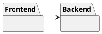
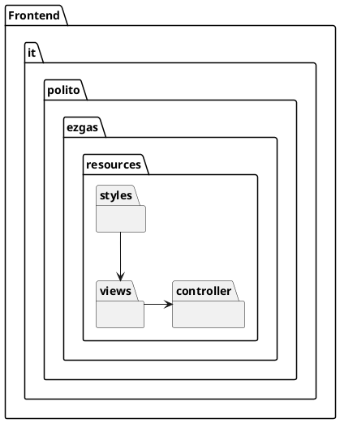
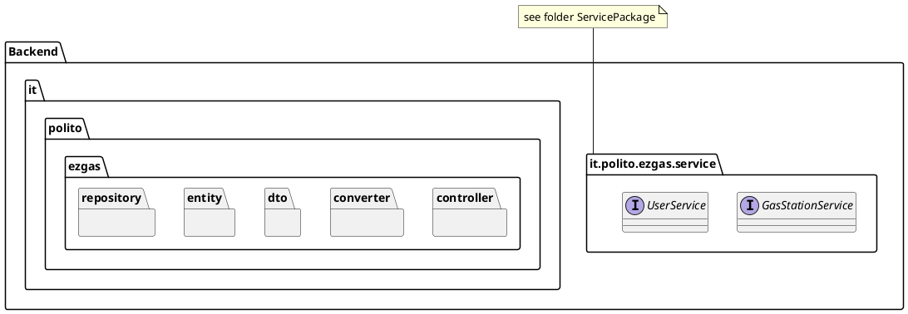

# Design Document 


Authors: Michele Filippini, Giovanni Brignone, Andrea Zappavigna, Dong Liu

Date: 14/06/2020

Version: 2 (changed class methods and fields to V2)


# Contents

- [High level design](#package-diagram)
- [Low level design](#class-diagram)
- [Verification traceability matrix](#verification-traceability-matrix)
- [Verification sequence diagrams](#verification-sequence-diagrams)

# Instructions

The design must satisfy the Official Requirements document (see EZGas Official Requirements.md ). <br>
The design must comply with interfaces defined in package it.polito.ezgas.service (see folder ServicePackage ) <br>
UML diagrams **MUST** be written using plantuml notation.

# High level design 

The style selected is client - server. Clients can be smartphones, tablets, PCs.
The choice is to avoid any development client side. The clients will access the server using only a browser. 

The server has two components: the frontend, which is developed with web technologies (JavaScript, HTML, Css) and is in charge of collecting user inputs to send requests to the backend; the backend, which is developed using the Spring Framework and exposes API to the front-end.
Together, they implement a layered style: Presentation layer (front end), Application logic and data layer (back end). 
Together, they implement also an MVC pattern, with the V on the front end and the MC on the back end.





## Front End

The Frontend component is made of: 

Views: the package contains the .html pages that are rendered on the browser and that provide the GUI to the user. 

Styles: the package contains .css style sheets that are used to render the GUI.

Controller: the package contains the JavaScript files that catch the user's inputs. Based on the user's inputs and on the status of the GUI widgets, the JavaScript controller creates REST API calls that are sent to the Java Controller implemented in the back-end.




## Back End

The backend  uses a MC style, combined with a layered style (application logic, data). 
The back end is implemented using the Spring framework for developing Java Entrerprise applications.

Spring was selected for its popularity and relative simplicity: persistency (M and data layer) and interactions are pre-implemented, the programmer needs only to add the specific parts.

See in the package diagram below the project structure of Spring.

For more information about the Spring design guidelines and naming conventions:  https://medium.com/the-resonant-web/spring-boot-2-0-project-structure-and-best-practices-part-2-7137bdcba7d3





The Spring framework implements the MC of the MVC pattern. The M is implemented in the packages Entity and Repository. The C is implemented in the packages Service, ServiceImpl and Controller. The packages DTO and Converter contain classes for translation services.


**Entity Package**

Each Model class should have a corresponding class in this package. Model classes contain the data that the application must handle.
The various models of the application are organised under the model package, their DTOs(data transfer objects) are present under the dto package.

In the Entity package all the Entities of the system are provided. Entities classes provide the model of the application, and represent all the data that the application must handle.


**Repository Package**

This package implements persistency for each Model class using an internal database. 

For each Entity class, a Repository class is created (in a 1:1 mapping) to allow the management of the database where the objects are stored. For Spring to be able to map the association at runtime, the Repository class associated to class "XClass" has to be exactly named "XClassRepository".

Extending class JpaRepository provides a lot of CRUD operations by inheritance. The programmer can also overload or modify them. 


**DTO package**

The DTO package contains all the DTO classes. DTO classes are used to transfer only the data that we need to share with the user interface and not the entire model object that we may have aggregated using several sub-objects and persisted in the database.

For each Entity class, a DTO class is created (in a 1:1 mapping).  For Spring the Dto class associated to class "XClass" must be called "XClassDto".  This allows Spring to find automatically the DTO class having the corresponding Entity class, and viceversa. 


**Converter Package**

The Converter Package contains all the Converter classes of the project.

For each Entity class, a Converter class is created (in a 1:1 mapping) to allow conversion from Entity class to DTO class and viceversa.

For Spring to be able to map the association at runtime, the Converter class associated to class "XClass" has to be exactly named "XClassConverter".


**Controller Package**

The controller package is in charge of handling the calls to the REST API that are generated by the user's interaction with the GUI. The Controller package contains methods in 1:1 correspondance to the REST API calls. Each Controller can be wired to a Service (related to a specific entity) and call its methods.
Services are in packages Service (interfaces of services) and ServiceImpl (classes that implement the interfaces)

The controller layer interacts with the service layer (packages Service and ServieImpl) 
 to get a job done whenever it receives a request from the view or api layer, when it does it should not have access to the model objects and should always exchange neutral DTOs.

The service layer never accepts a model as input and never ever returns one either. This is another best practice that Spring enforces to implement  a layered architecture.


**Service Package**


The service package provides interfaces, that collect the calls related to the management of a specific entity in the project.
The Java interfaces are already defined (see file ServicePackage.zip) and the low level design must comply with these interfaces.


**ServiceImpl Package**

Contains Service classes that implement the Service Interfaces in the Service package.


# Low level design

<Based on the official requirements and on the Spring Boot design guidelines, define the required classes (UML class diagram) of the back-end in the proper packages described in the high-level design section.>
```plantuml
package "it.polito.ezgas.controller" {
	class HomeController {
		+ admin(): String
		+ index(): String
		+ map(): String
		+ login(): String
		+ update(): String
		+ signup(): String
	}

	class UserController {
		~ userService : UserService
		+ getUserById(Integer userId) : UserDto
		+ getAllUsers() : List<UserDto>
		+ saveUser(UserDto userDto) : UserDto
		+ deleteUser(Integer userId) : Boolean
		+ login(IdPw credentials) : LoginDto
		+ increaseUserReputation(Integer userId) : Integer
		+ decreaseUserReputation(Integer userId) : Integer
	}

	class GasStationController {
		~ gasStationService : GasStationService
		+ getGasStationById (Integer gasStationId) : GasStationDto
		+ saveGasStation(GasStationDto gasStationDto)
		+ getAllGasStations() : List<GasStationDto>
		+ deleteGasStation(Integer gasStationId)
		+ getGasStationsByGasolineType(String gasolinetype) : List<GasStationDto>
		+ getGasStationsByProximity(Double myLat, Double myLon, Integer myRadius) : List<GasStationDto>
		+ getGasStationsWithCoordinates(Double myLat, Double myLon, Integer myRadius, String gasolinetype, String carsharing) : List<GasStationDto>
		+ setGasStationReport(PriceReportDto priceReportDto)
	}
}

package "it.polito.ezgas.service" {
	interface UserService {
		{abstract} + getUserById(Integer userId) : UserDto
		{abstract} + saveUser(UserDto userDto) : UserDto
		{abstract} + getAllUsers() : List<UserDto>
		{abstract} + deleteUser(Integer userId) : Boolean
		{abstract} + login(IdPw credentials) : LoginDto
		{abstract} + increaseUserReputation(Integer userId) : Integer
		{abstract} + decreaseUserReputation(Integer userId) : Integer
	}

	interface GasStationService {
		{abstract} + getGasStationById(Integer gasStationId) : GasStationDto
		{abstract} + saveGasStation(GasStationDto gasStationDto) : GasStationDto
		{abstract} + getAllGasStation() : getAllGasStations()
		{abstract} + deleteGasStation(Integer gasStationId) : Boolean
		{abstract} + getGasStationByGasolineType(String gasolinetype) : List<GasStationDto>
		{abstract} + getGasStationByProximity(double lat, double lon) : List<GasStationDto>
		{abstract} + getGasStationByProximity(double lat, double lon, int radius) : List<GasStationDto>
		{abstract} + getGasStationWithCoordinates(double lat, double lon, int radius, String gasolinetype, String carsharing) : List<GasStationDto>
		{abstract} + getGasStationWithoutCoordinates(String gasolineType, String carsharing) : List<GasStationDto>
		{abstract} + setReport(Integer gasStationId, Double dieselPrice, Double superPrice, Double superPlusPrice, Double gasPrice, Double methanePrice, Double premiumDieselPrice, Integer userId)
		{abstract} + getGasStationByCarSharing(String carSharing) : List<GasStationDto> 
	}

	package "it.polito.ezgas.service.impl" {
		class UserServiceimpl {
			- userRepository : UserRepository
			+ UserServiceimpl(UserRepository userRepository)
			+ getUserById(Integer userId) : UserDto
			+ saveUser(UserDto userDto) : UserDto
			+ getAllUsers() : List<UserDto>
			+ deleteUser(Integer userId) : Boolean
			+ login(IdPw credentials) : LoginDto
			+ increaseUserReputation(Integer userId) : Integer
			+ decreaseUserReputation(Integer userId) : Integer
		}

		class GasStationServiceimpl {
			- gasStationRepository : GasStationRepository
			- userRepository : UserRepository
			+ GasStationServiceimpl(GasStationRepository gasStationRepository, UserRepository userRepository)
			+ getGasStationById(Integer gasStationId) : GasStationDto
			+ saveGasStation(GasStationDto gasStationDto) : GasStationDto
			+ getAllGasStation() : getAllGasStations()
			+ deleteGasStation(Integer gasStationId) : Boolean
			+ getGasStationByGasolineType(String gasolinetype) : List<GasStationDto>
			+ getGasStationByProximity(double lat, double lon) : List<GasStationDto>
			+ getGasStationByProximity(double lat, double lon, int radius) : List<GasStationDto>
			+ getGasStationWithCoordinates(double lat, double lon, int radius, String gasolinetype, String carsharing) : List<GasStationDto>
			+ getGasStationWithoutCoordinates(String gasolineType, String carsharing) : List<GasStationDto>
			+ setReport(Integer gasStationId, Double dieselPrice, Double superPrice, Double superPlusPrice, Double gasPrice, Double methanePrice, Double premiumDieselPrice, Integer userId)
			+ getGasStationByCarSharing(String carSharing) : List<GasStationDto>
			{static} + isPriceValid(GasStation g) : boolean
			{static} + isReportPriceValid(GasStation g) : boolean
			{static} + isCoordinateValid(double lat, double lon) : boolean
			+ dependability(GasStation gasStation) : double
			{static} + distance(double lat1, double lon1, double lat2, double lon2) : double
		}
	}
}

package "it.polito.ezgas.dto" {
	class GasStationDto {
		- gasStationId : Integer
		- gasStationName : String
		- gasStationAddress : String
		- hasDiesel : boolean
		- hasSuper : boolean
		- hasSuperPlus : boolean
		- hasGas : boolean
		- hasMethane : boolean
		- hasPremiumDiesel : boolean
		- carSharing : String
		- lat : double
		- lon : double
		- dieselPrice : Double
		- superPrice : Double
		- superPlusPrice : Double
		- gasPrice : Double
		- methanePrice : Double
		- premiumDieselPrice : Double
		- reportUser : Integer
		- userDto : UserDto
		- reportTimestamp : String
		- reportDependability : double
	}

	class IdPw {
		- user: String
		- pw: String
	}

	class LoginDto {
		- userId: Integer
		- userName: String
		- token: String
		- email: String
		- reputation: Integer
		- admin: Boolean
	}

	class UserDto {
		- userId : Integer
		- userName : String
		- password : String
		- email : String
		- reputation : Integer
		- admin : Boolean
	}

	class PriceReportDto {
		~ gasStationId: Integer
		~ dieselPrice: Double
		~ superPrice: Double
		~ superPlusPrice: Double
		~ gasPrice: Double
		~ methanePrice: Double
		~ premiumDieselPrice: Double
		~ userId: Integer
	}

	GasStationDto "*" - "0..1" UserDto
}

package "it.polito.ezgas.converter" {
	class UserConverter {
		+ toUserDto (User user) : UserDto
		+ toUser (UserDto userDto) : User
	}

	class GasStationConverter {
		+ toGasStationDto (GasStation gasStation) : GasStationDto
		+ toGasStation (GasStationDto gasStationDto) : GasStation
	}
}

package "it.polito.ezgas.repository" {
	class GasStationRepository {
		+ findByHasDieselTrueOrderByDieselPrice() : List<GasStation>
		+ findByHasGasTrueOrderByGasPrice() : List<GasStation>
		+ findByHasMethaneTrueOrderByMethanePrice() : List<GasStation>
		+ findByHasSuperTrueOrderBySuperPrice() : List<GasStation>
		+ findByHasSuperPlusTrueOrderBySuperPlusPrice() : List<GasStation>
		+ findByHasPremiumDieselTrueOrderByPremiumDieselPrice() : List<GasStation>
		+ findByCarSharingOrderByCarSharing(String carSharing) : List<GasStation>
	}

	class UserRepository {    
		+ findByPasswordAndEmail(String password, String email) : List<User>
		+ findByEmail(String email) : List<User>
	}
}

package "it.polito.ezgas.entity" {
	class GasStation {
		- gasStationId : Integer
		- gasStationName : String
		- gasStationAddress : String
		- hasDiesel : boolean
		- hasSuper : boolean
		- hasSuperPlus : boolean
		- hasGas : boolean
		- hasMethane : boolean
		- hasPremiumDiesel : boolean
		- carSharing : String
		- lat : double
		- lon : double
		- dieselPrice : Double
		- superPrice : Double
		- superPlusPrice : Double
		- gasPrice : Double
		- methanePrice : Double
		- premiumDieselPrice : Double
		- reportUser : Integer
		- reportTimestamp : String
		- reportDependability : double
		- User user
	}

	class User {
		- userId : Integer
		- userName : String
		- password : String
		- email : String
		- reputation : Integer
		- admin : Boolean
	}

	class PriceReport {
		- priceReportId: Integer
		- user: User
		- dieselPrice: double
		- superPrice: double
		- superPlusPrice: double
		- gasPrice: double
	}

	GasStation "*" - "0..1" User
}

GasStationController --> GasStationService
GasStationController --> GasStationDto
GasStationController --> PriceReportDto
UserController --> UserService
UserController --> UserDto

GasStationService <|.. GasStationServiceimpl
UserService <|.. UserServiceimpl

GasStationServiceimpl --> GasStationDto
GasStationServiceimpl --> UserDto
GasStationServiceimpl --> GasStation
GasStationServiceimpl --> User
GasStationServiceimpl --> GasStationConverter
GasStationServiceimpl --> UserConverter
GasStationServiceimpl --> GasStationRepository
GasStationServiceimpl --> UserRepository
UserServiceimpl --> UserDto
UserServiceimpl --> User
UserServiceimpl --> UserRepository
UserServiceimpl --> IdPw
UserServiceimpl --> LoginDto

GasStationDto --> GasStationConverter
UserDto --> UserConverter

GasStationConverter --> GasStation
UserConverter --> User

GasStationRepository --> GasStation
UserRepository --> User
UserConverter <-- GasStationConverter 
```

# Verification traceability matrix

\<for each functional requirement from the requirement document, list which classes concur to implement it>

|         | UserServiceImpl | GasStationServiceImpl | UserRepository | GasStationRepository | PriceReportRepository | GasStationController | UserController | User | GasStation | PriceReport | GasStationDto | LoginDto | PriceReportDto | UserDto | IdPw |
| ------------- |:-------------:|:--:|:--:|:--:|:--:|:--:|:--:|:--:|:--:|:--:|:--:|:--:|:--:|:--:|:--:|
|  FR1.1     | X |  | X |  |  |  | X | X | | | | | | X | |
|  FR1.2     | X |  | X |  |  |  | X | | | | | | | | |
|  FR1.3     | X |  | X |  |  |  | X | X | | | | | | X | |
|  FR1.4     | X |  | X |  |  |  | X | X | | | | | | X | |
|  FR2       | X |  | X |  |  |  | X | X | | | | X | | | X |
|  FR3.1     |  | X |  | X |  | X |  |  | X | | X | | | | |
|  FR3.2     |  | X |  | X |  | X |  | | | | | | | | |
|  FR3.3     |  | X |  | X |  | X |  |  | X | | X | | | | |
|  FR4.1     |  | X |  | X |  | X |  | | X | | X | | | | |
|  FR4.2     |  | X |  | X |  | X |  | | X | | X | | | | |
|  FR4.3     |  | X |  | X |  | X |  |  | | | | | | | |
|  FR4.4     |  | X |  | X |  | X |  | | X | | X | | | | |
|  FR4.5     |  | X |  | X |  | X |  | | X | | X | | | | |
|  FR5.1     |  | X | X | X | X | X |  | X | X | X | | | | | |
|  FR5.2     |  | X |  | X |  |  |  | | X | | | | | | |
|  FR5.3     | X |  | X |  |  |  | X | X | | | | | | | |


# Verification sequence diagrams 
\<select key scenarios from the requirement document. For each of them define a sequence diagram showing that the scenario can be implemented by the classes and methods in the design>

## UC1 Nominal Scenario - Create User Account
```plantuml
	hide footbox
	EzGasUI->>UserController: saveUser()
    UserController->>UserService: saveUser()
	UserService->>UserConverter: toUser()
	UserService<<-UserConverter: User
	UserService->>UserRepository: save()
	UserService<<-UserRepository: User
	UserService->>UserConverter: toUserDto()
	UserConverter->>UserService: UserDto
	UserController<<-UserService: UserDto
	EzGasUI<<-UserController: UserDto
```


## UC2 Nominal Scenario - Modify user account

```plantuml
	EzGasUI->>UserController: saveUser()
    UserController->>UserService: saveUser()
	UserService->>UserConverter: toUser()
	UserService<<-UserConverter: User
	UserService->>UserRepository: save()
	UserService<<-UserRepository: User
	UserService->>UserConverter: toUserDto()
	UserConverter->>UserService: UserDto
	UserController<<-UserService: UserDto
	EzGasUI<<-UserController: UserDto
```

## UC3 Nominal Scenario - Delete user account
```plantuml
	hide footbox
	EzGasUI->>UserController: deleteUser()
    UserController->>UserService: deleteUser()
	UserService->>UserRepository: delete()
	UserController<<-UserService: boolean
	EzGasUI<<-UserController: boolean
```

## UC4 Nominal Scenario - Create Gas Station
```plantuml
	hide footbox
	EzGasUI->>GasStationController: saveGasStation()
	GasStationController->>GasStationService: saveGasStation()
	GasStationService->>GasStationConverter: toGasStation()
	GasStationService<<-GasStationConverter: GasStation
	GasStationService->>GasStationRepository: save()
	GasStationService<<-GasStationRepository: GasStation
	GasStationService->>GasStationConverter: toGasStationDto()
	GasStationConverter->>GasStationService: GasStationDto
	GasStationController<<-GasStationService: GasStationDto
```

## UC5 Nominal Scenario - Modify Gas Station information
```plantuml
	hide footbox
	EzGasUI->>GasStationController: saveGasStation()
	GasStationController->>GasStationService: saveGasStation()
	GasStationService->>GasStationConverter: toGasStation()
	GasStationService<<-GasStationConverter: GasStation
	GasStationService->>GasStationRepository: save()
	GasStationService<<-GasStationRepository: GasStation
	GasStationService->>GasStationConverter: toGasStationDto()
	GasStationConverter->>GasStationService: GasStationDto
	GasStationController<<-GasStationService: GasStationDto
```

## UC6 Nominal Scenario - Delete Gas Station
```plantuml
	hide footbox
	EzGasUI->>GasStationController: deleteGasStation()
    	GasStationController->>GasStationService: deleteGasStation()
	GasStationService->>GasStationRepository: findOne()
	GasStationService<<-GasStationRepository: GasStation
	GasStationService->>GasStationRepository: delete()
	GasStationController<<-GasStationService: boolean
```

## UC7 Nominal Scenario - Report fuel price for a gas station
```plantuml
	hide footbox
	EzGasUI->>GasStationController: setGasStationReport()
	GasStationController->>GasStationService: setReport()
	GasStationService->>GasStationRepository: findOne()
	GasStationService<<-GasStationRepository: GasStation
	GasStationService->>UserRepository: findOne()
	GasStationService<<-UserRepository: User
	GasStationService->>GasStationRepository: save()
```

## UC8 Nominal Scenario - Obtain price of fuel for gas stations in a certain geographic area
```plantuml
	hide footbox
	EzGasUI->>GasStationController: getGasStationsByProximity()
	GasStationController->>GasStationService: getGasStationsByProximity()
	GasStationService->>GasStationRepository: findAll()
	GasStationService<<-GasStationRepository: List<GasStation>
	GasStationService->>GasStationConverter: toGasStationDto()
	GasStationConverter->>GasStationService: GasStationDto
	GasStationController<<-GasStationService: List<GasStationDto>
	EzGasUI<<-GasStationController: List<GasStationDto>
```

## UC9 Nominal Scenario - Update trust level of price list
Every time a gas station is retrieved from the database and returned to the user,
the price trust level is computed.
```plantuml
	hide footbox
	GasStationServiceImpl->>GasStation: getReportTimeStamp()
	GasStationServiceImpl<<-GasStation: String
	GasStationServiceImpl->>GasStation: getUser()
	GasStationServiceImpl<<-GasStation: Integer
	GasStationServiceImpl->>UserRepository: findOne()
	GasStationServiceImpl<<-UserRepository: User
	GasStationServiceImpl->>User: getReputation()
	GasStationServiceImpl<<-User: long
	GasStationServiceImpl->>GasStation: setReportDependability()
	GasStationServiceImpl->>GasStationConverter: toGasStationDto()
	GasStationServiceImpl<<-GasStationConverter: GasStationDto
	<<-GasStationServiceImpl: GasStationDto
```	
	
## UC10 - Evaluate price

### Scenario 10.1 - Increase Reputation
```plantuml
	hide footbox
	EzGasUI->>UserController: increaseUserReputation()
	UserController->>UserService: increaseUserReputation()
	UserService->>UserRepository: findOne()
	UserService<<-UserRepository: User
	UserService->>UserRepository: save()
	UserService<<-UserRepository: User
	UserController<<-UserService: Integer
	EzGasUI<<-UserController: Integer
```

### Scenario 10.2 - Decrease Reputation
```plantuml
	hide footbox
	EzGasUI->>UserController: decreaseUserReputation()
	UserController->>UserService: decreaseUserReputation()
	UserService->>UserRepository: findOne()
	UserService<<-UserRepository: User
	UserService->>UserRepository: save()
	UserService<<-UserRepository: User
	UserController<<-UserService: Integer
	EzGasUI<<-UserController: Integer
```

